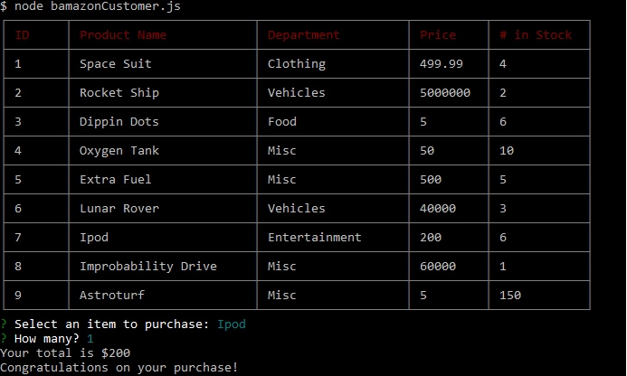
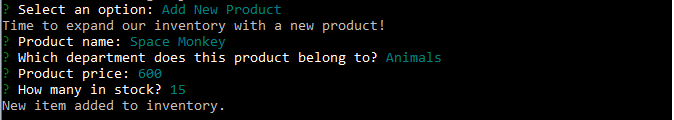
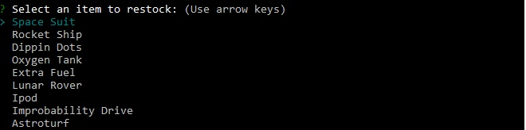
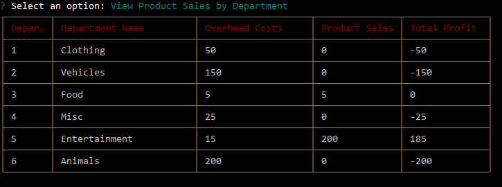

# bamazon-app

###Welcome to Bamazon, the most convenient NodeJS-based shopping portal you have ever seen. This app was created to gain a deeper understanding of MySQL databases, and features some basic inventory tracking and purchasing. 

Here are a few screenshots of the app. Feel free to download it and run the schema.sql to set up your database with some initial data.

###Customer Shopping View

###Managers Can Create New Items on the Fly

###Managers Can Restock Items

###Executives Can See High-Level Sales Information

